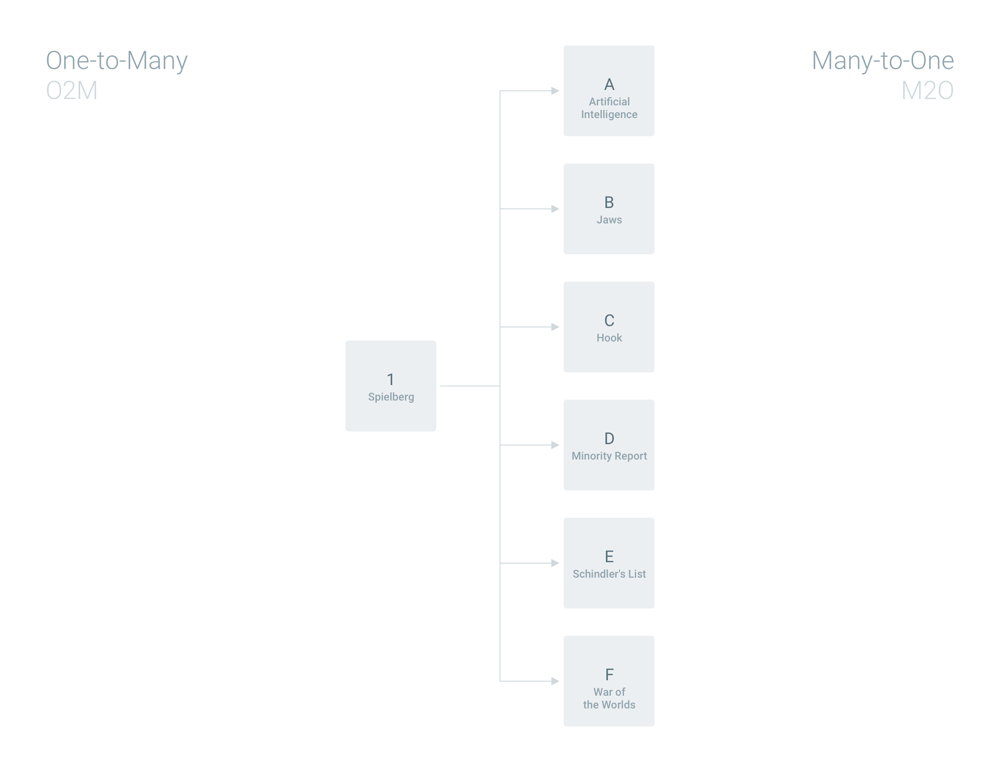

# App Admin Guide

## Installation

1. 
2. 
3. 

## Updating

1. 
2. 
3. 

## Global Settings

These are settings that apply to the entire project environment.

* **Auto Sign Out** – The number of minutes until inactive users will be automatically logged out of the application.
* **File Naming** – A naming convention for uploaded files, options include:
  * `uuid` – This is the default option, a universally unique identifier
  * `original` – A sanitized version of the original file name, incremented as needed for uniqueness
  * `id` – The `directus_files.id` left-padded with `0`
* **Logo** – If you would like to use your own logo you can upload it here. Specifications:
  * _Dimensions_ – 200px wide and 60px tall
  * _Format_ – PNG or SVG
  * _Color_ – White foreground with a transparent background
* **Thumbnail Dimensions** – RENAME
* **Thumbnail Quality** – RENAME
* **Thumbnail Fit** – RENAME

## Collections & Fields

This is where you will create and configure your database schema and its interfaces.

### Adding Collections

Adding a collection is easy, simply click the New button ("+") in the header and enter a name. This is the technical name used in the database and API so you should follow the [schema naming convention](#). Display formatting will be handled automatically by App.

#### Note

This is for internal use only. It helps your administrators understand the purpose of each collection.

#### Item Name Template

This [Mustache template](#) allows you to set a default/fallback formatted name for items in the collection. 

@TODO: DO WE USE THIS ANYWHERE?

#### Hidden

Some helper collections are not used directly (eg: junctions) and can be globally hidden.

#### Single

In certain schema architectures, you may find it helpful to have a collection that can only contain one item. For example, the "About" or "Settings" of your project might be managed within the fields of a single item (also known as a "singleton"). When enabled, clicking the collection in the navigation will open the Item Detail page directly, skipping the Items Browse page.

#### Translation

This JSON object can be used to translate the collection name into different languages/locales. It can also be used to override the formatted display name generated from the schema name.

```json
{
    "example": "here"
}
```

### Managing Collections

Collections added through Directus are automatically managed, however collections added outside of Directus are unmanaged by default. This avoids issues with dynamically created temporary tables or any tables outside the scope of your project. Directus completely ignores any unmanaged collections.

### Deleting Collections

To destroy a collection and all of its data you can click the Delete Button ("×") in the header of the collection detail. You will be asked only once to confirm this permanent action.

::: warning
It is possible to irreverisbly delete massive amounts of data with this feature. Proceed with extreme caution.
:::

### Adding Fields

Adding a field to Directus is straightforward, but the process varies depending on what type of field you are creating. Let's walk through the four possible steps in order.

#### Choosing an Interface

Do you want a Toggle? Text Input? Map? Dropdown? Relationship? There are many Core Interfaces available here, with even more Extension Interfaces available. This is always the first step when creating a new field, and dictates the rest of the process.

#### Schema Options

Only the "Name" is required for this step, but it's good to familiarize yourself with the other options to get the most out of each field.

* **Name** – The technical name used in the database and API. It should be letters only, lowercase, with underscores for spaces.
* **Display Name** – You can not edit this value, it is just a preview of the above technical name in a more human readable format. This is how users will see the field name throughout the App.
* **Note** – This optional note will appear beside the field on the Item Detail page to give helpful context to users.

##### Advanced

* **Datatype** – TK
* **Length** – TK
* **Default** – TK
* **Validation** – TK
* **Validation Message** – ADD
* **Required** – TK
* **Readonly** – TK
* **Unique** – TK
* **Hidden on Detail** – RENAME
* **Hidden on Items** – RENAME

#### Relationships

##### One-to-Many & Many-to-One

In relational databases, a one-to-many (O2M) relationship exists when an item of **Collection A** may be linked to many items of **Collection B**, but an item of **Collection B** is linked to only one item of **Collection A**. For example, directors have many movies, but a movie only has one director.

Now let's translate this to Directus interfaces. The `directors` collection could have a multi-select listing of every movie (a O2M interface). However you could also view at this relationship in the opposite direction, which would be a dropdown of directors on the `movies` collection (a M2O interface). So a O2M relationship is also a M2O (and vice versa)... it just depends on which way you look at it.

An easy way to remember which side is which: the "many" is an actual column that stores the foreign key, while the "one" side is a simulated column using the `ALIAS` datatype.



##### Many-to-Many (M2M)

The many-to-many (M2M) is a slightly more advanced relationship that allows you to link _any_ items within **Collection A** and **Collection B**. For example, movies can have many genres, and genres can have many movies.

Technically this is not a _new_ relationship type... it is a O2M and M2O working together across a "junction" collection. Each item in the junction (eg: `movies_genres`) is a single link between one item in `movies` and one item in `genres`.


##### Many-to-Many-Many (M2MM)

In some data models it ise useful to have an interface link items from **Collection A** to many items within _many_ collections (**B**, **C**, **D**, etc). We call this a many-to-many-many (M2MM) but it is sometimes called a "Matrix Field". 

Directus handles the M2MM exactly like a M2M, with one exception: foreign keys must be universally-unique-identifiers (UUID). Since Directus UUIDs are prefixed with the collection name, this avoids the ambiguity of not knowing which collection a primary key belongs to.

So when would you use a M2MM? One common example is articles built from modules from different collections. Instead of using a free-form WYSIWYG editor, headers, text, photos, and quotes could be assembled in a more structured way. This could allow for validation, reusablility, and more complex layouts.


#### Interface Options

Interfaces are highly customizable with options that allow you to tailor them to individual uses. These vary depending on interface complexity, with more edge-case options collapsed within an "Advanced" accordion.

### Reordering Fields

Reordering fields provides a natural default order within the Items page and can be an important part of database optimization.

### Form Grid

Meaningful 2D forms can be designed by assigning dimensions and coordinates to each field. This provides the ability to create a more intuitive user flow, group related fields, and tailor field size to the interface needs.

Field widths are set to one of the standardized Directus options to maintain a proper grid system.

### Deleting Fields

Clicking the "×" icon on the right side of the Fields interface will completely delete the field from the schema as well as all its Item data. You are prompted to confirm this action, however once the field delete is executed the change takes place immediately.

::: warning
It is possible to irreverisbly delete massive amounts of data with this feature. Proceed with extreme caution.
:::

## Roles & Permissions

Directus permissions are extremely granular and powerful, but don't feel overwhelmed, you don't need to use or even understand the more advanced features to setup basic roles. 

### Administrators

Users with this role have full permissions for all data within the system and are the only ones with access to Admin Settings. The administrator role is included by default and can not be edited or removed. 

### Public

This special role defines what data is accessible _without_ being authenticated. The public role is included by default (with all permissions off) and can not be removed.

### Creating Roles

You can also create additional roles that limit access for specific purposes. As of now, users can only be assigned to a single role, but our system is architected in a way to allow for merging multiple roles in the future.

#### Inviting Users

TK

#### Description

This is for internal use only. It helps your administrators understand the purpose of each role.

#### IP Whitelist

A CSV of IP addresses that are allowed to connect to the APP/API. This can be used to limit access to specific offices, for example.

#### Navigation Override

A JSON object that allows for customizing the navigation sidebar. With the feature you can reorder collections, add links to specific items or external pages, and create new groupings. The default dynamic sections can still be included using the reserved `$collections`, `$extensions`, and `$bookmarks` values.

```json
{
    "Collections": {
        "Z. Collection Name": "/collections/collection-name",
        "X. Collection Name": "/collections/collection-name",
        "Y. Collection Name": "/collections/collection-name",
        "Specific Item Name": "/collections/collection-name/123",
        "External Link": "https://example.com"
    },
    "Another Group": {
        "A. Collection Name": "/collections/collection-name",
        "B. Collection Name": "/collections/collection-name",
        "C. Collection Name": "/collections/collection-name"
    },
    "Favorites": "$bookmarks",
    "Extensions": "$extensions"
}
```

### Permissions

Directus extends the typical CRUD access control to add even more granularity. For more information on how to set the base permissions (Create, Read, Update, Delete, Comment, and Explain) please read our dedicated Docs here.

::: tip
Use the "All/None" shortcut on hover of each row or click the column header to toggle that permission for all collections.
:::

#### Field Read/Write Blacklist

Clicking on the "Fields" button allows you to set blacklists for both read and write. This allows you to control which fields are visible or editable for the collection. All fields are readable and writable by default.

#### Status Blacklist

Clicking on the "Status" button allows you to set a blacklist of which status options. This allows you to control which status options a user can choose – for example, not allowing an Intern to _publish_ items. All statuses are available by default.

#### Workflow

Workflows are one of the most powerful features of Directus. They allow for all the other permission settings to be controled **per status**. This feature compounds the utility, but it can be difficult to fully understand its potential, so let's explore an example with all the bells and whistles:


#### Directus Collections

### Deleting Roles

## Extensions

### Interfaces

### Pages

### Layouts

### SSO Services

### Storage Adapters

## Terminology

* `project` – An external application using Database managed data
* `instance` – An API install managing one or more environments on a server
* `environment` or `env` – A SQL database (eg: `production`, `staging`, etc)
* `schema` – The SQL database's architecture, not including any content
* `boilerplate` – The base schema and system content included in a fresh/blank copy of Directus
* `collection` – A SQL table
* `item` – A SQL record
* `field` – A SQL column or _alias_ (see below)
* `alias` – A field that does not actually map to a database column (eg: a divider)
* `datatype` – The SQL vendor-specific database storage type (eg: `VARCHAR`, `BIGINT`, etc)
* `directus type` – An extended and agnostic storage type mapped to SQL vendor datatypes (eg: `M2O`, `STATUS`, etc)
* `length` – The amount/size of data that can be stored in a field
* `interface` – The GUI for a field
* `layout` – The GUI for a collection's items
* `extension` – Components outside of the Core codebase, including: Interfaces, Pages, Storage Adapters, SSO Services, etc
* `single collection` – A collection limited to only one item
* `comment` – A message left on an item
* `note` – Descriptive text displayed with a field
* `template` – A Mustache string used to format field values (eg: `{{first_name}} {{last_name}}, {{title}}`)


* **Collections** – Page displaying a listing of of collections within an instance/env
* **Items** – Page displaying a listing of of items within a collection
* **Item** – Page displaying field interfaces used for creating, viewing, and updating an item
