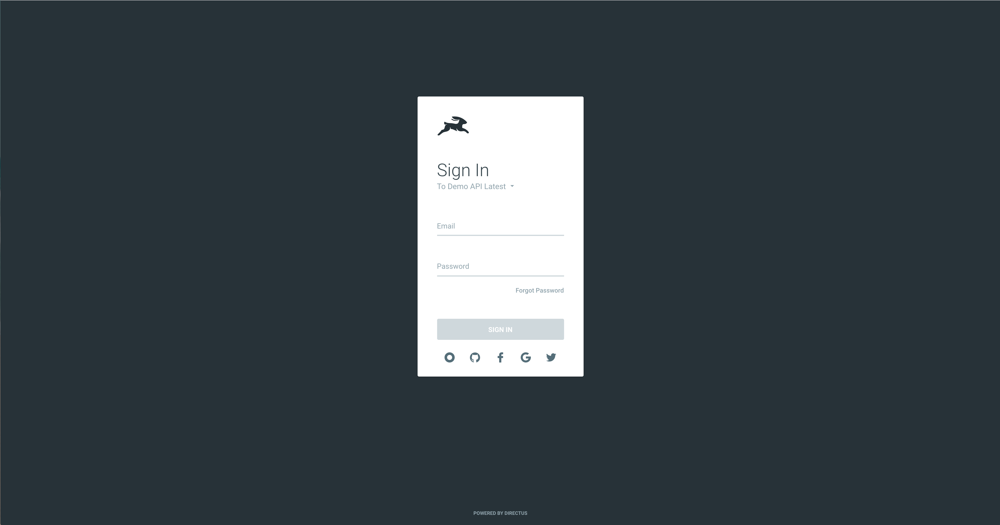

# User Guide

## What is Directus

## Login

::: warning
Nobody ever needs your password!
:::

### Forgot password

### Changing projects

### Logging out

### Single Sign-On

Next to the default secure login, Directus allows you to use several external services as means of authentication. 

When [the system has been configured to allow you to login with external services](#), the logos of these services will show up on the login form:

Clicking one of these icons will take you to a secure login page of the service you chose. Directus will allow you to login with your external account as long as it's using the same email address as your user account in Directus.

## Overview

@TODO: screenshot of interface

### Header

The header bar will show you where you currently are in the system and will provide you with a set of actions you can perform on the current page. Most of the times, these actions will be related to managing item(s), like saving, deleting, or modifying the selection.

### Navigation Sidebar

The navigation sidebar shows you links to your collections, bookmarks, and extensions. This sidebar is accessible in all pages in the system.

#### Logo & Loading indicator

Everytime the application is working on something—like saving or retrieving items—the logo in the top left will transform into a loading indicator. 

#### Project Switcher

To switch from your currently in use project to another, you can click on the project name in the top left. This section also shows you the current connection status with the system. Hovering over the project switcher will show you the URL you're currently connected to and will show you the latency to the server.

#### Collection Navigation

The first of three sections of links shows the links to all the available collections.

::: tip
Your system administrator has the ability to [override the links](#) in the sidebar, so the way it looks and works might differ in your application.
:::

#### Extensions

The second section of links contains the different installed extensions. These pages provide extra functionality in the system.

::: tip
This menu won't show up if there aren't any extensions installed in the system.
:::

#### Bookmarks

The third and last section of links contains your bookmarks. To learn more about bookmarking pages, see [the bookmarking section](#bookmarking).

### User Menu

The user menu in the bottom left shows your currently in use user and it's avatar. Hovering over this section reveals the user menu. In this menu, you'll find different links based on your user group. 

### Info Sidebar

The info sidebar contains more information or settings for the current page. On collection pages for example, this sidebar allows you to configure the way your data is displayed. 

### Page

The main section of the page contains the actual page content.

## Pages

### Collections

### Items

#### Layouts (below we talk about Tabular only, with tips for others
#### Layout Options (changing fields, spacing, etc)
#### Reordering
#### Selecting (bulk edit, delete) & Opening
#### Bookmarking
#### Searching
#### Filtering
#### Sorting

### Item Detail

#### Required Fields
#### Saving
#### Activity & Revisions
#### Reverting
#### Comments & Mentions
#### Translations
#### Deleting

### File Library

#### Uploading & Adding Files

### User Directory

### My Account

### My Activity

## Permissions
## Status & Workflow
